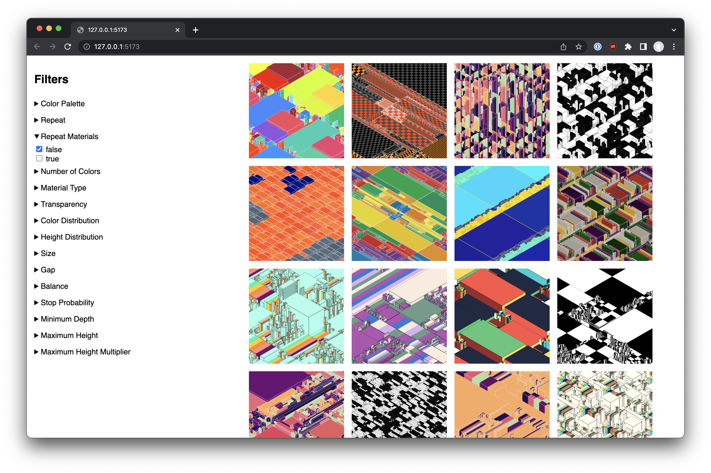

# Gallery

A filterable gallery of images, built with [SvelteKit](https://kit.svelte.dev/). Note that this is not optimized: images are not responsive, and the gallery is not paginated. This is a proof-of-concept, only meant to be run locally.



Populate the `static/content` folder (may require creation) with images and their corresponding JSON files, e.g. `Block Party 64.json` and `Block Party 64.png`.

## Running the App

Install dependencies with `npm install` (node v16+), then start the development server:

```bash
npm run dev
```

## Building

To create a production version of the app:

```bash
npm run build
```

You can preview the production build with `npm run preview`.

> To deploy your app, you may need to install an [adapter](https://kit.svelte.dev/docs/adapters) for your target environment.
